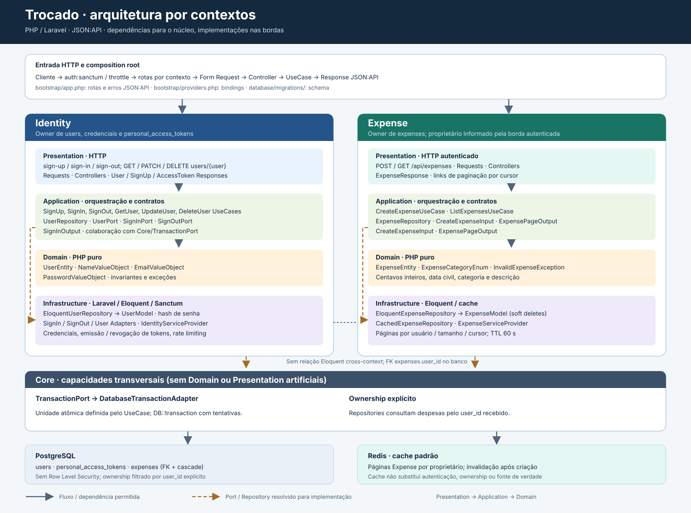

# Arquitetura do Trocado

Este documento apresenta a arquitetura **implementada** na POC e as convenções para sua evolução. A fonte normativa das decisões é [ARCHITECTURE.md](ARCHITECTURE.md), complementada por [`.ai/guidelines/`](.ai/guidelines/) e pelas especificações em [`openspec/specs/`](openspec/specs/). Em caso de divergência, essas fontes prevalecem sobre esta visão explicativa.



[Abrir o diagrama em tamanho completo](arch.svg)

## Visão geral

O Trocado é um backend de API JSON:API em PHP/Laravel. O código de negócio é agrupado por **bounded context**, e cada contexto contém somente as camadas de que precisa. Laravel participa deliberadamente das bordas; o núcleo de domínio e a orquestração da aplicação não dependem do framework.

```text
app/
├── Core/
│   ├── Application/Ports/
│   └── Infrastructure/{Adapters,Providers}/
├── Identity/
│   ├── Domain/{Entities,ValueObjects,Exceptions}/
│   ├── Application/{Data,Exceptions,Ports,Repositories,UseCases}/
│   ├── Infrastructure/{Adapters,Repositories/Persistence/Models,Providers}/
│   └── Presentation/{Routes,Http/{Controllers,Requests,Responses}}/
└── Expense/
    ├── Domain/{Entities,Enums,Exceptions}/
    ├── Application/{Data,Exceptions,Repositories,UseCases}/
    ├── Infrastructure/{Repositories/{Cache,Persistence/Models},Providers}/
    └── Presentation/{Routes,Http/{Controllers,Requests,Responses}}/
```

O autoload `App\` aponta para `app/`. `bootstrap/app.php` conecta as rotas de cada contexto e converte exceções em erros JSON:API; `bootstrap/providers.php` registra os providers de Core, Expense e Identity. `database/migrations/` e `routes/console.php` são pontos globais de composição, não lugares para regras de negócio.

## Camadas e direção das dependências

| Camada | Responsabilidade | Exemplos no projeto | Limite |
| --- | --- | --- | --- |
| **Domain** | Conceitos, invariantes, entidades, value objects, enums e exceções de domínio. | `UserEntity`, `NameValueObject`, `ExpenseEntity`, `ExpenseCategoryEnum`. | PHP puro; sem Laravel, HTTP, banco ou conhecimento de outras camadas. |
| **Application** | Casos de uso, contratos de persistência/capacidade e dados de entrada/saída. | `SignUpUseCase`, `ListExpensesUseCase`, `UserRepository`, `ExpenseRepository`, `ExpensePageOutput`. | Depende de Domain e contratos próprios; não importa Eloquent, facades, Presentation ou implementações de Infrastructure. |
| **Infrastructure** | Implementa as fronteiras da Application e integra framework, ORM, autenticação, transações e cache. | `EloquentExpenseRepository`, `CachedExpenseRepository`, `SignInAdapter`, service providers. | Pode depender de Application/Domain; Models e queries não vazam pelos contratos. |
| **Presentation** | Entrada/saída HTTP: rotas, middleware, Form Requests, controllers e recursos JSON:API. | `CreateExpenseRequest`, `CreateExpenseController`, `ExpenseResponse`. | Chama Application; controllers não persistem nem implementam regras de negócio. |

**Setas de dependência de código:** `Presentation → Application → Domain` e `Infrastructure → Application/Domain`. A chamada em execução cruza os contratos no sentido inverso: um UseCase usa um `Repository` ou `Port` definido na Application, e o container injeta o Repository/Adapter correspondente da Infrastructure. Os providers registram essas ligações; UseCases concretos são resolvidos sem interfaces ou bindings próprios. Models Eloquent de bounded contexts diferentes não importam uns aos outros; relações entre tabelas permanecem no banco via foreign keys.

## Bounded contexts

### Identity — identidade e autenticação

É o **owner exclusivo** da identidade local e das tabelas `users` e `personal_access_tokens`: registro, consulta/atualização/encerramento de conta, credenciais, emissão e revogação de token. Não há allowlist de outro contexto para consultar diretamente `users`.

- **Domain:** `UserEntity` contém `NameValueObject` e `EmailValueObject`; `PasswordValueObject` valida a senha antes da criação. O nome normaliza espaços, aceita letras Unicode separadas por espaços e exige 2 a 12 letras; o e-mail é normalizado e validado; a senha exige 6 a 12 caracteres, maiúscula e número. Essas invariantes sobrevivem mesmo fora de HTTP.
- **Application:** `SignUpUseCase`, `SignInUseCase`, `SignOutUseCase`, `GetUserUseCase`, `GetUserByEmailUseCase`, `UpdateUserUseCase` e `DeleteUserUseCase`; contrato `UserRepository`, Ports `UserPort`, `SignInPort` e `SignOutPort`, além de `SignInOutput`. Cadastro e encerramento usam `TransactionPort` de Core.
- **Infrastructure:** `EloquentUserRepository` mapeia `UserEntity` para `UserModel`; o cast `hashed` mantém o hash de senha na borda. `SignInAdapter` valida credenciais pelo provider Laravel e emite Personal Access Token do Sanctum; `SignOutAdapter` revoga o token atual; `UserAdapter` fornece o principal autenticado. O encerramento remove tokens e usuário dentro da unidade transacional definida pelo UseCase.
- **Presentation:** `POST /api/authentication/sign-up`, `POST /api/authentication/sign-in`, `DELETE /api/authentication/sign-out` e `GET`, `PATCH`, `DELETE /api/users/{user}`. Cadastro é a única criação pública de conta; não há `POST /api/users` ou listagem global `GET /api/users`. Os recursos JSON:API usam os tipos `users`, `sign-ups` e `access-tokens`.

### Expense — despesas da conta

É o owner da despesa, de sua criação e da listagem das despesas do proprietário autenticado. Não importa classes de Identity nas camadas de Domain ou Application: recebe o ID do usuário pela borda HTTP. A associação com Identity existe no banco por `expenses.user_id`, sem relações Eloquent cruzadas entre os Models dos contextos.

- **Domain:** `ExpenseEntity` protege proprietário e valor positivos, data civil válida em `Y-m-d`, descrição de até 64 caracteres e categoria válida (`ExpenseCategoryEnum`; padrão `other`). O valor monetário é armazenado em **centavos inteiros**, sem aritmética em ponto flutuante.
- **Application:** `CreateExpenseUseCase` e `ListExpensesUseCase`; `CreateExpenseInput` e `ExpensePageOutput`; `ExpenseRepository` para escrita/listagem. UseCases não conhecem cache, Redis, tags ou TTL.
- **Infrastructure:** `EloquentExpenseRepository` persiste e faz paginação por cursor ordenando `occurred_on DESC, id DESC`; `CachedExpenseRepository` decora o repository real com cache de página por proprietário/tamanho/cursor e TTL de 60 segundos; `ExpenseModel` usa soft deletes.
- **Presentation:** `POST /api/expenses` e `GET /api/expenses` sob `auth:sanctum` e rate limit autenticado; `CreateExpenseRequest`/`ListOwnedExpensesRequest`, controllers finos e `ExpenseResponse` (`type: expenses`). A listagem oferece links `next`/`prev` para os cursores. Não há endpoints implementados para editar ou excluir individualmente uma despesa.

### Core — capacidades transversais

Não é um terceiro domínio de negócio nem um lugar para entidades compartilhadas indiscriminadamente. Possui `TransactionPort` em Application, implementado por `DatabaseTransactionAdapter` em Infrastructure, oferecendo unidade transacional com tentativas. `CoreServiceProvider` registra essa fronteira e o rate limit autenticado. Não há Domain ou Presentation artificiais em Core.

## Fluxos representativos

1. **Cadastro:** rota pública → `SignUpRequest` → `SignUpController` → `SignUpUseCase` → VOs/`UserEntity` → `TransactionPort` → `EloquentUserRepository` → `users` → `SignUpResponse`. Unicidade de e-mail é protegida também pelo banco.
2. **Autenticação:** rota pública → `SignInUseCase` → `SignInPort`/`SignInAdapter` → provider de usuário e Sanctum → `personal_access_tokens` → `SignInOutput` → `AccessTokenResponse`. O logout revoga apenas o token corrente.
3. **Criação de despesa:** Bearer token → middleware `auth:sanctum`/throttle → Form Request/controller → `CreateExpenseUseCase` → `ExpenseRepository` → `CachedExpenseRepository` → `EloquentExpenseRepository` → `expenses`; após criação confirmada, o decorator invalida o cache do proprietário → `ExpenseResponse`.
4. **Listagem:** Bearer token → Form Request/controller → `ListExpensesUseCase` → `ExpenseRepository`; em cache miss, `CachedExpenseRepository` consulta `EloquentExpenseRepository::listByUser` com filtro explícito por proprietário; em cache hit, evita nova consulta de persistência → `ExpensePageOutput` → `ExpenseResponse` e links de cursor.

## Dados, isolamento e consistência

- O banco configurado para a aplicação é **PostgreSQL**. `expenses.user_id` referencia `users.id` com exclusão em cascata; os Models Eloquent dos contextos não declaram relações cruzadas. `ExpenseModel` filtra linhas soft-deleted por padrão; apagar a conta remove as despesas pela FK.
- O projeto não usa PostgreSQL Row Level Security. Ownership é explícito nos contratos e queries de Expense por meio de `user_id`.
- Índices, FK, unicidade e políticas do banco são a última barreira de integridade concorrente. `TransactionPort` delimita operações atômicas no UseCase; callbacks podem ser repetidos e não devem executar efeitos externos não transacionais. Rate limiting e eventual prevenção de sobreposição de Scheduler têm finalidade operacional, não substituem constraints/locks.
- `config/cache.php` define Redis como store padrão e deixa o limiter configurável separadamente. O cache de Expense armazena projeção de páginas por conta por 60 segundos; após uma criação, a invalidação ocorre depois da operação confirmada. Leituras concorrentes ainda podem observar dados antigos até o TTL. A persistência continua sendo a fonte de verdade.
- Fora de produção, os providers impedem lazy loading de relações Eloquent para revelar N+1 dentro de cada contexto.

## API e composição do framework

O fluxo preferencial é **HTTP → Form Request → Controller → UseCase → Response → HTTP**. Form Requests verificam o formato do transporte, enquanto Domain repete as invariantes essenciais. Os recursos em `Presentation/Http/Responses` estendem `Illuminate\Http\Resources\JsonApi\JsonApiResource` e delegam ao suporte first-party o envelope `data`; IDs de recursos são strings. Erros são convertidos em `errors` JSON:API em `bootstrap/app.php`, inclusive erros de validação com `source.pointer`. Rotas recebem os prefixos de API em `bootstrap/app.php` e são definidas por contexto em `Presentation/Routes/api.php`.

`IdentityServiceProvider`, `ExpenseServiceProvider` e `CoreServiceProvider` registram somente fronteiras necessárias (`Repository → EloquentRepository`, `Port → Adapter`); rate limiters e proteções Eloquent são inicializados na borda. Commands futuros pertencem a `Infrastructure/Console/Commands`, resolvem relógio/configuração na borda e passam parâmetros explícitos aos UseCases; o agendamento, se necessário, pertence a `routes/console.php`.

## Nomenclatura e padrões de projeto

| Papel | Local e exemplo | Critério |
| --- | --- | --- |
| `Entity`, `ValueObject`, `Enum`, `Exception` | `Domain/Entities/ExpenseEntity`, `Domain/ValueObjects/NameValueObject` | Estado e invariantes de negócio; sem interfaces para Entity/VO. |
| `UseCase` | `Application/UseCases/CreateExpenseUseCase` | Orquestra uma ação; classe concreta com injeção por construtor. |
| `Input`, `Output` | `Application/Data/CreateExpenseInput`, `ExpensePageOutput` | Agrupam contrato coeso; `final readonly`, constructor-only, sem framework ou serialização HTTP. Não usar `Result` como sufixo da Application. |
| `Repository` | `Application/Repositories/ExpenseRepository` | Contrato para consultas/persistência de agregado, sem tipos de ORM. |
| `Port` / `Adapter` | `Application/Ports/TransactionPort` / `Infrastructure/Adapters/DatabaseTransactionAdapter` | Contrato de capacidade externa e sua implementação concreta. |
| `Eloquent…Repository`, `…Model` | `Infrastructure/Repositories/Persistence/EloquentExpenseRepository` e `Models/ExpenseModel` | Persistência Eloquent e mapping simples dentro do Repository. |
| `Request`, `Controller`, `Response` | `Presentation/Http/Requests/CreateExpenseRequest` etc. | Validação do transporte, coordenação HTTP e representação JSON:API. |
| `ServiceProvider`, `Command` | `Infrastructure/Providers/ExpenseServiceProvider`, `Infrastructure/Console/Commands/` | Composição de dependências e adaptador de CLI, respectivamente. |

Os nomes das dependências no construtor exprimem o papel (`$port`, `$useCase`, `$repository` quando único; nomes qualificados quando há mais de um) e a ordem prevista para UseCases é **Port → UseCase → Repository**. Use `Input` quando uma entrada coesa com muitos parâmetros justificar isso; três ou mais valores heterogêneos nomeados de saída pedem `Output`. Entities, VOs, escalares e coleções homogêneas continuam retornos naturais. Interfaces só representam fronteiras reais; evite `Base*` especulativos, `GenericRepository`, `CrudRepository`, Mappers triviais e rótulos vagos como `Manager` ou `Helper`. Em PHP, prefira tipos explícitos, `declare(strict_types=1)`, imports com `use`, property promotion e objetos imutáveis quando apropriado.

## Referências para manutenção

- [Decisões e limites arquiteturais](ARCHITECTURE.md)
- [Guidelines por camada e nomenclatura](.ai/guidelines/)
- [Especificações funcionais](openspec/specs/)
- [Diagrama vetorial da arquitetura](arch.svg)
